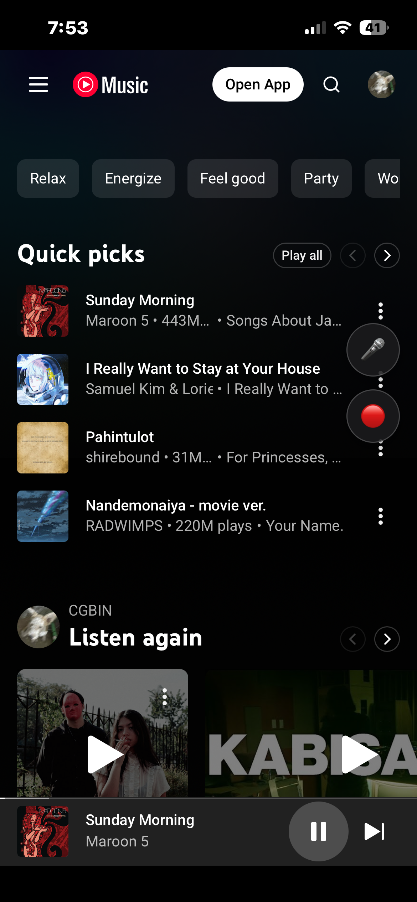
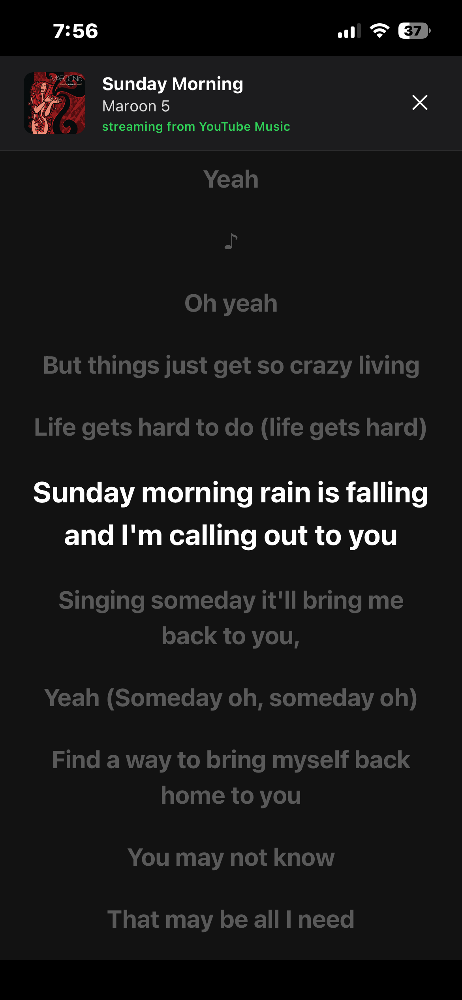
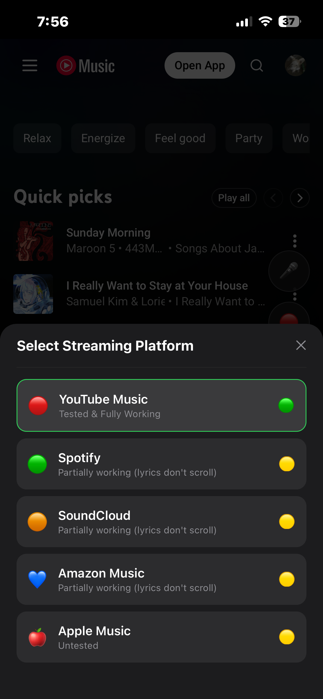
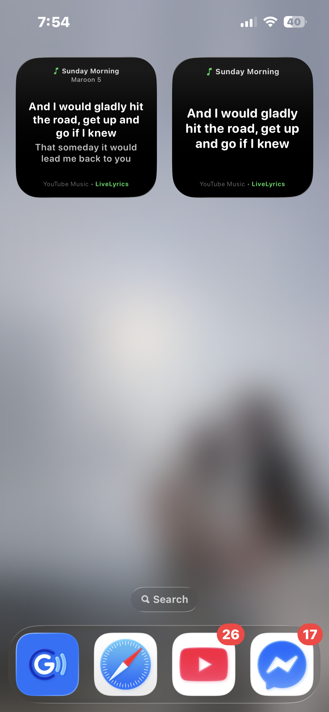
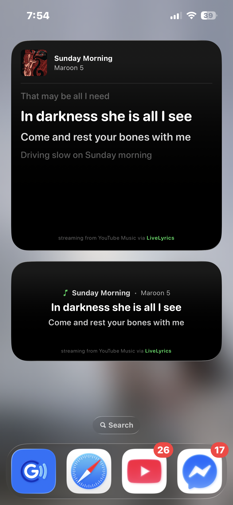
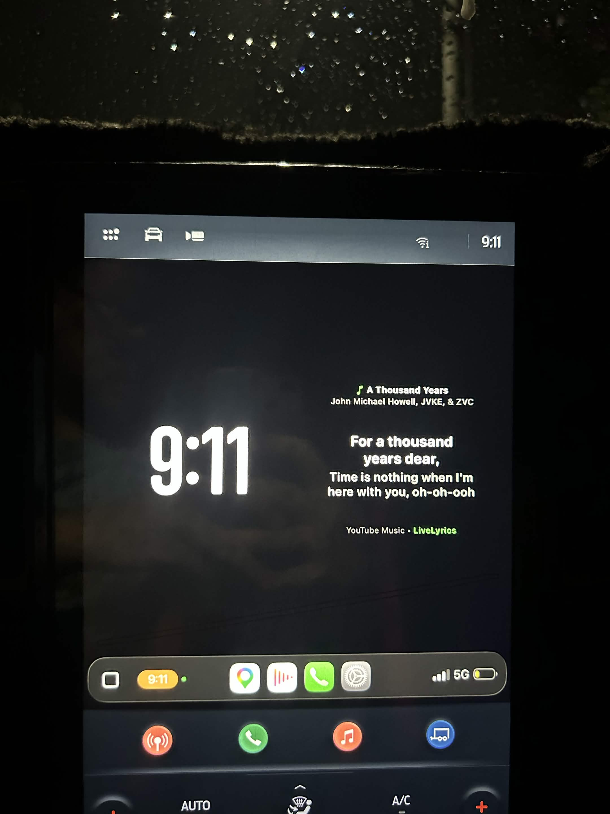
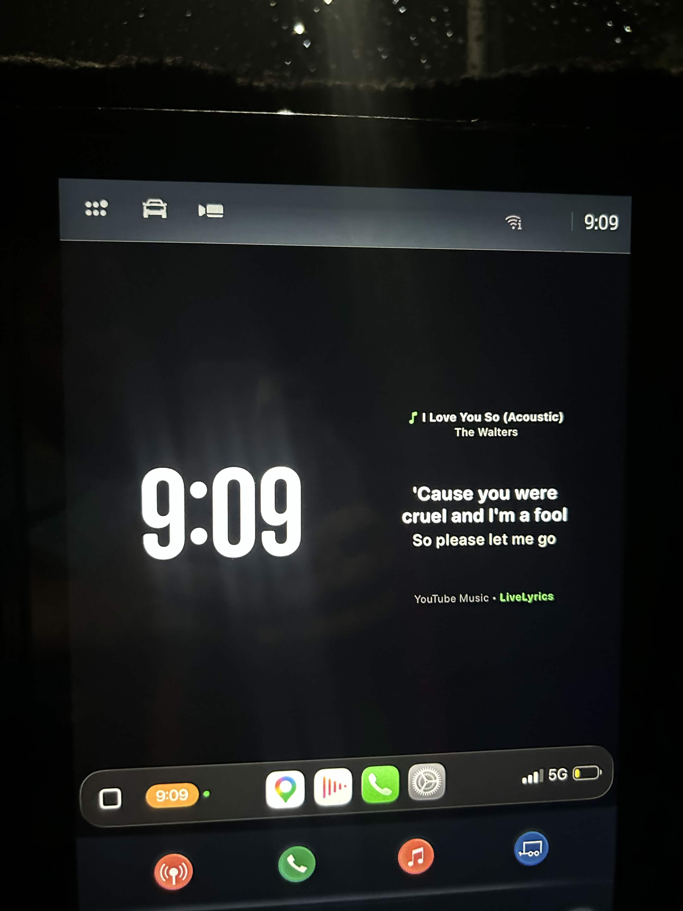
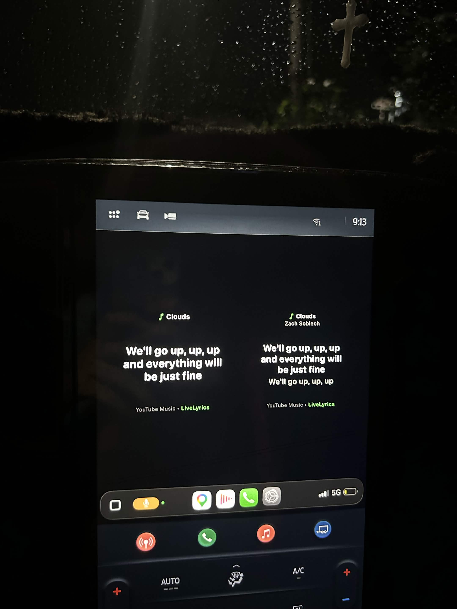

# 🎵 LiveLyrics

> Real-time synced lyrics for your iOS Home Screen, Lock Screen, and CarPlay dashboard.

<table align="center">
  <tr>
    <td align="center">
      <small><b>In-App Player</b></small><br/>
      
    </td>
    <td align="center">
      <small><b>Live Lyrics (🎤)</b></small><br/>
      
    </td>
    <td align="center">
      <small><b>Platform Select (🔴)</b></small><br/>
      
    </td>
  </tr>
  <tr>
    <td align="center">
      <small><b>Lock Screen</b></small><br/>
      
    </td>
    <td align="center">
      <small><b>Small Widgets</b></small><br/>
      
    </td>
    <td align="center">
      <small><b>Medium/Large Widgets</b></small><br/>
      
    </td>
  </tr>
  <tr>
    <td align="center">
      <small><b></b></small><br/>
      
    </td>
    <td align="center">
      <small><b>CarPlay Dashboard</b></small><br/>
      
    </td>
    <td align="center">
      <small><b></b></small><br/>
      
    </td>
  </tr>
</table>

## 💡 Concept & Vision

**LiveLyrics** is an all-in-one music platform aggregator operating as a web wrapper (embedding web versions of YouTube Music, Spotify, Apple Music, etc.). It extracts live moving lyrics directly from web player DOM nodes in real-time and broadcasts them natively across iOS WidgetKit surfaces.

### Future Roadmap (Ranked by Priority)

- 📲 **Android Deployment:** Extend cross-platform support to Android, leveraging the core React Native and Expo architecture.
- 🍎 **Native Player Integration:** Deep hooks into native iOS and Android media APIs and system controls, enabling support for native app playback instead of relying on a web wrapper.
- 🎛️ **Interactive Widget Controls:** On-widget media controls, including lyric timing offset controls to recalibrate lyric delays and pull alternative lyric variations on the fly.
- 🎨 **Personalization & Customization:** Customizable widget color schemes, theme presets, and toggles for visible UI elements.
- 🫂 **Crowdsourced Lyrics Timing Realignment:** Aggregate global user timing adjustments to automatically re-align lyric timing, compensating for CarPlay and WidgetKit render delays.
- 🔊 **Ambient IRL Music Recognition:** Real-time ambient audio identification to detect music playing around you in physical spaces and stream live synced lyrics directly to your iPhone widgets and CarPlay dashboard.

---

## ✨ Key Features & Widget Suite

- **Web Wrapper Aggregator:** Stream music from supported web services (YouTube Music as default) inside a unified wrapper interface.
- **Live Lyrics:** Pulls from a large repository of music lyrics in LRC format.
- **Complete Widget Family Suite:**
  - **Small Widget** - title + current line;
  - **Small Dual Widget** - same as above with + artist + next line;
  - **Medium Widget** - same as above except bigger (no CarPlay);
  - **Large & Extra Large Widgets** - same as above except bigger + previous line + 1 more next line (no CarPlay);
  - **Lock Screen: Accessory Rectangle** - small title + current line (no CarPlay); and
  - **Lock Screen: Accessory Circular** - circular progress bar (no CarPlay).
- **Continuous Background Audio:** Persistent audio session and lyric streaming when the app is backgrounded or when the iPhone screen is locked.
- **Adaptive Formatting:** Prioritizes fitting the current and next lyrics -- avoids truncation and clears other elements like title/artist if needed.
- **Dynamic Branding Footers:** Smart contextual fallbacks when no song/platform is playing (e.g., _"sing-along with your favorite platforms thru LiveLyrics"_ vs. _"streaming from YouTube Music via LiveLyrics"_).

---

## 📱 User Guide

### How to Use on iOS

1. Open **LiveLyrics** and select your preferred music platform (default is YouTube Music).
2. Search and play a song or playlist.
3. Return to your **iOS Home Screen** `->` **Enter Jiggle Mode** `->` **Tap +** `->` **Add _live-lyrics_ widget**.
4. Customize to your preferred widget size.

### How to Use on CarPlay

1. Connect your iPhone to CarPlay.
2. On your iPhone: Go to **Settings** `->` **General** `->` **CarPlay** `->` **[Your Vehicle]** `->` **Widgets**.
3. Tap **Add Widgets** and select **LiveLyrics**.

### Reporting Issues

Found a bug or a broken web player scraper target? Please report it [here](https://github.com/shankencedric/live-lyrics/issues).

---

## 🛠 Technical Architecture & Stack

- **Frontend App:** React Native / Expo (TypeScript) wrapped around web audio players.
- **Native iOS Layer:** Swift, Objective-C, SwiftUI, WidgetKit (`AVAudioSession`, `MPNowPlayingInfoCenter`).
- **Inter-Process Communication (IPC):** Native Swift bridge (`AppGroupModule`) writing state to shared `UserDefaults(suiteName: "group.com.shankencedric.livelyrics")`.
- **Package Name:** `com.shankencedric.livelyrics`
- **App Group Identifier:** `group.com.shankencedric.livelyrics`

### Data Flow Diagram

```
[Web Player DOM Scraper]
       │
       ▼
[React Native JS Layer]
       │
       ▼
[AppGroupModule (Swift/Obj-C Bridge)]
       │
       ▼
[UserDefaults ("group.com.shankencedric.livelyrics")]
       │
       ▼
[WidgetKit TimelineProvider]
       │
       ▼
[SwiftUI Widget Views (Home Screen / Lock Screen / CarPlay)]
```

---

## 💻 Developer Setup & Building Guide

### Prerequisites

- macOS device (macOS Sonoma / Sequoia recommended)
- Xcode 15+
- Node.js
- Active Apple Developer Account (paid not required for personal deployment)

### Building on a Real macOS Device

1. **Install Prerequisites:**

```bash
brew install npm
```

2. **Clone & Install Dependencies:**

```bash
git clone https://github.com/shankencedric/live-lyrics.git
cd live-lyrics
npm install
```

3. **Open Xcode Workspace:**

```bash
open ios/*.xcworkspace
```

4. **Configure Xcode Signing & Capabilities:**

- In Xcode, go to **Settings** `->` **Accounts** and sign in with your Apple ID.
- Click the top-level `livelyrics` project item in the navigator.
- For **both targets** (`livelyrics` and `LiveLyricsWidget`):
  - Go to **Signing & Capabilities**.
  - Set **Team** to your Personal Team.
  - Under **App Groups**, enable the capability and tick `group.com.shankencedric.livelyrics`.

5. **Configure Physical iPhone:**

- On your iPhone: Go to **Settings** `->` **Privacy & Security** `->` **Developer Mode** and enable it.
- Connect your iPhone to your Mac via USB.
- Select your iPhone in Xcode's top target selector (will look like `livelyrics > 📱 Your iPhone`).
- On iPhone, go to **Settings** `->` **General** `->` **VPN & Device Management** `->` **[Your Developer Email]** `->` **Trust**.

6. **Run Build:**

```bash
npx expo run:ios
```

### Note on macOS Virtual Machines (VMware)

> You can build using a macOS VM (as I did) following the exact steps above. But before starting, I recommend ensuring you _can_ sign in with your Apple ID in **Settings** `->` **Sign In**. Recent versions of macOS detect VMs and restrict this feature even in Xcode. Without signing in Xcode, you can't enable app build signing, which in turn stops you from making a personal build for your iPhone.

> To go around this, I heard using QEMU over VMWare helped. Alternatively, as I did, you may need to first install an earlier version of macOS (e.g., Sonoma 15), sign in to the Settings and Xcode (manual download), then do a software update to the latest version (Tahoe 26), and lastly do a manual one for Xcode as well. This is what worked for me, but it's honestly difficult to replicate.

---

## 🔄 Regenerating & Restoring the `ios/` Folder

Expo Prebuild could wipe custom native target configurations when regenerating directories. Follow these steps if you delete or regenerate the `ios/` folder:

1. **Regenerate Native Shell:**

```bash
npx expo prebuild --platform ios --clean
```

2. **Recreate Widget Target in Xcode:**

- Open in Xcode: `open ios/*.xcworkspace`.
- Go to **File** -> **New** -> **Target...**
- Under the **iOS** tab, select **Widget Extension** and click **Next**.
- Set **Product Name** to `LiveLyricsWidget`.
- Uncheck **Include Live Activity** (unless required).
- Ensure **Project** is set to `livelyrics` and **Embed in Application** is set to `livelyrics`.
- Click **Finish**, then click **Activate** on the scheme activation prompt.
- Delete the template `.swift` file automatically generated inside the new `LiveLyricsWidget` folder so it can be replaced with your custom code.

3. **Restore Native Source Files:**

- Copy all `*.swift`, `*.m`, and `*.h` files from `<git-origin>/ios/livelyrics/livelyrics` into `<working-branch>/ios/livelyrics/livelyrics/`.
- Do the same for the `ios/LiveLyricsWidget/` folder.

4. **Link Files in Xcode:**

- Right-click `livelyrics/livelyrics` and `livelyrics/LiveLyricsWidget` in Xcode -> **Add Files to "livelyrics"...**
- Select the respective files and ensure **"Create groups"** and **"Reference"** options are checked (do not duplicate files).

5. **Restore Capabilities & Settings:**

- Re-add **App Groups** (`group.com.shankencedric.livelyrics`) to capabilities of both targets (`livelyrics` and `LiveLyricsWidget`).
- Re-add **Background Modes -> Audio, AirPlay, and Picture in Picture** to the main `livelyrics` target.

6. **Rebuild:**

```bash
npx expo run:ios
```

---

## ⚖️ Copyright & Terms of Use

**LiveLyrics** is a proprietary prototype developed for showcase, educational, and personal use.

- **Copyright (c) 2026 Sean Ken Cedric Legara. All Rights Reserved.**
- **Personal Use Allowed:** You are welcome to inspect the source code, build the app, and run personal builds on your own devices for personal, non-commercial use.
- **No Redistribution or Commercialization:** Public redistribution, hosting pre-compiled binaries, publishing modified derivatives, or submitting this software (or its parts) to any app store or marketplace is strictly prohibited.

If you are interested in using LiveLyrics or its underlying architecture for commercial applications, custom builds, or third-party distribution, please contact **[legara.connect@gmail.com](mailto:legara.connect@gmail.com)** to discuss a commercial license.
